<h1 align="center">Hey  I'm Aryan Singh</h1>
<h3 align="center">Grade II CyberSec Analyst and Trainer</h3>

  

## 📌 About Me
- Cybersecurity enthusiast & developer focused on building secure, intelligent systems.
- At 19, I’ve worked on real-world security investigations, engineered AI-based tools, and built automation systems that solve practical problems. I specialize in Python, Linux (Red Hat), network security, and ethical hacking, combining academic knowledge with hands-on execution.

## 🧠 My Focus Areas
- Criminal investigations
- Offensive Security
- Exploit Development
- Malware Analysis
- Penetration Testing
- Digital Forensics
- Automation & AI-based Applications
- Web & Network Security

## 📊 GitHub Stats & Trophies

  
  

  

  

  

## 🛠️ Languages & Tools

> ## Programming Languages

  

> ## Frontend

  

> ## Backend

> ## Database

 

> ## DevOps & Cloud

> ## Tools

 

  

## 🔗 Connect with Me

 

<picture>
  <source media="(prefers-color-scheme: dark)" srcset="https://raw.githubusercontent.com/abozanona/abozanona/output/pacman-contribution-graph-dark.svg">
  <source media="(prefers-color-scheme: light)" srcset="https://raw.githubusercontent.com/abozanona/abozanona/output/pacman-contribution-graph.svg">
  
</picture>

  

